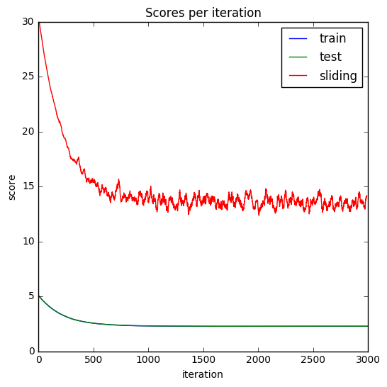
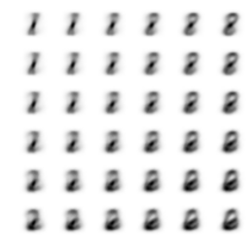
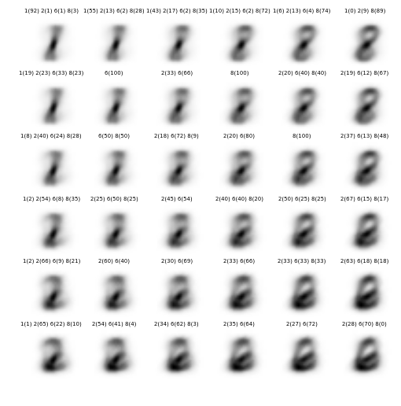
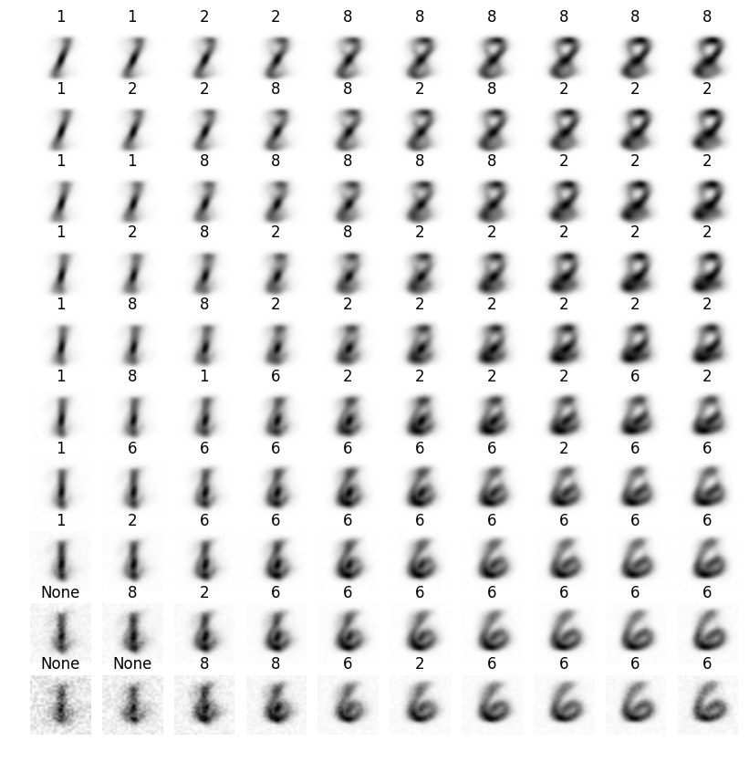
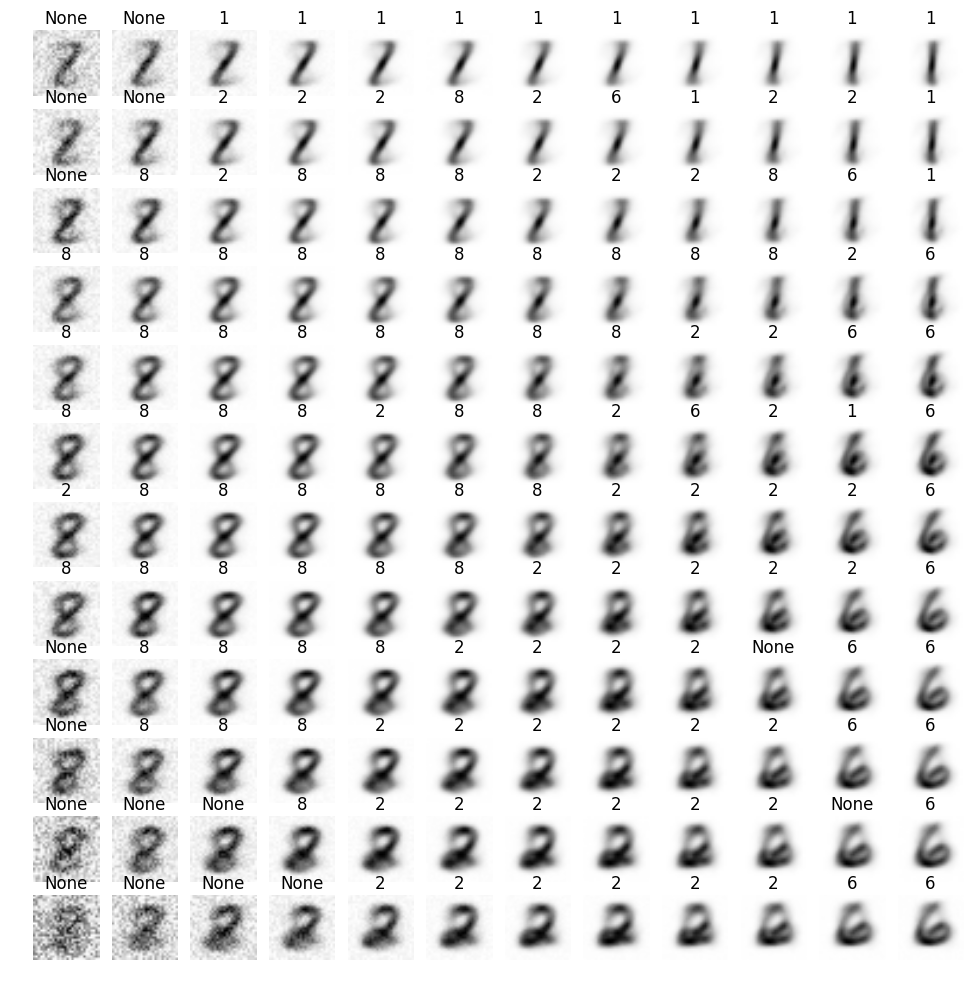
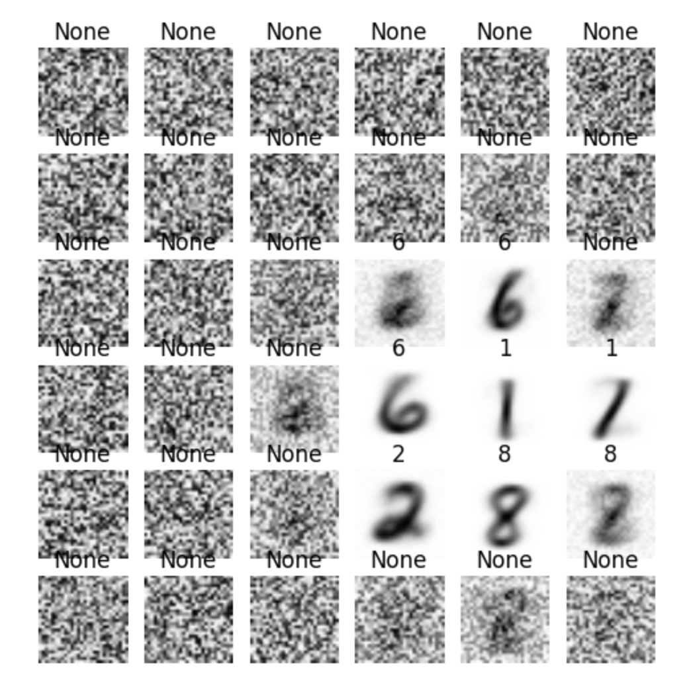
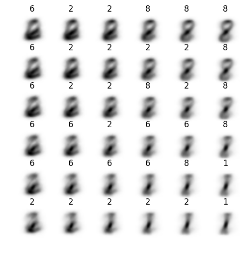
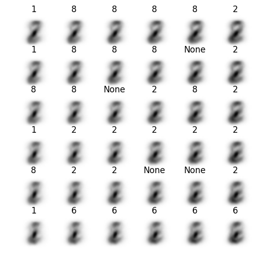

# Kohonen maps on hand-written digits 

Nicolas Casademont, Teo Stocco

*Unsupervised and reinforcment learning in neural networks* 2016 class, EPFL.

## Abstract

Using [MNIST dataset](http://yann.lecun.com/exdb/mnist/), this project shows how Kohonen maps can be adapted to classify 4 selected hand-written digits. It suggests a method to assign digits to Kohonen prototypes and analyze the variation of parameters: network size, neighborhood function width. The best parameters achieve an error rate of $CHANGE$ % over $4\cdot 500=2000$ samples.

## Learning rate

Starting with default parameters ($36$ neurons, unit distance, $\sigma=3$), the learning rate has been empirically chosen based on the number of iteration. $\eta=0.005$ seems to converge fast enough with accurate precision over $5000$ iterations.

The convergence is determined using $L2$-norm over all samples (slow): once the gradient of the norm stablizes around 0 given a threshold tolerance (e.g. $0.0025$ works well with a learning rate of $\eta=0.005$). Splitting the data into train and test datasets (naive $10$ % cut) have been tried but no overfitting issue appeared. Thus in order to keep the algorithm efficient, a $10$-elements sliding window over the train samples is used to approximate the full norm (used as convergence criteria, not for evaluation).

Comparison of train, test, sliding norms learning curve.

## Prototypes

Each digit is represented by a $28\cdot 28=784$ pixels array with support $\in [0, 255]\subset \mathbb{N}$. The competitive learning specialized each prototypes to represent one kind of hand-written digits. Corners are far away from each others and thus represents the highest variation with recognizable digits. The prototypes in-between show how the variation progress from one corner to another. For instance the top-right corner is specialized to represent the digit $8$. By comparing to top-left one, the prototype show how one can change the digit 1 to obtain digit 8.

Prototypes for ($36$ neurons, unit distance, $\sigma=3$, $\eta=0.005$, $t=5000$). The top-left corner has mostly $1$s, the top-right $8$s, the bottom-left $2$s and the bottom-right $6$s.

## Digit assignment

To assign automatically each prototypes to a digit, the closest the prototype is chosen for each sample. Gathering then all samples having the same closest prototype give an empirical repartition from which the highest occuring label can be picked up. This give to each prototype the label that is most represented by itself and achieve an error rate of $~30.65$ %. The following show how tuning parameters affect this result.

This show the digit repartition (%) for each prototypes by selecting the closest prototype over all samples.

## Exploration

### Network size

The network size affects the specialisation of each prototypes. The largest the network is the more different prototypes and more intermediate representation between two digits there will be. This allow more flexible assignements but could lead to some sparsity in the assigments (some prototypes do not represent any specific digits, assigning them to the closest one could be solution).

SCORE CHANGE ?

($64$ neurons, $\sigma=5$, decay rate $?$)

($100$ neurons, $\sigma=5$, decay rate $0.9$)

($144$ neurons, $\sigma=5$, decay rate $0.85$)

### Neighborhood function width

The neighborhood function width affects the generality of the prototypes. When small neighboring function are used, the current step update is mostly based on the winner neuron whereas when large ones are used, the current step update include larger contribution from loser neurons leading to less precise prototypes. 

SCORE CHANGE ?

($36$ neurons, $\sigma=1$, decay rate $0.54$)

($36$ neurons, $\sigma=3$, decay rate $0.58$)

($36$ neurons, $\sigma=5$, decay rate $?$)

Does the optimal width depend on the size of the Kohonen map?

....

($?$ neurons, $\sigma=5$, decay rate $?$)

### Dynamic neighborhood function width

Varying the neighborhood function width over time affects the ...
This allows the network to stablize the network by being more plastic at the begining and more rigid at the end resulting in a faster convergence and less prone to final variation.
 

c’est un moyen de représenter l’éloignement des noeuds 
ça permet de stabiliser plus proprement les prototype
3. Petit truc je te fournirais une image de la fonction qui réduit sigma avec les différents coefficients.

SCORE CHANGE ?

($?$ neurons, $\sigma=5$, decay rate $?$)

($?$ neurons, $\sigma=5$, decay rate $?$)

($?$ neurons, $\sigma=5$, decay rate $?$)

## Conclusion

Exploration different parameter settings showed how different choice impact the specifity, generality and ... of the prototypes. By fine tuning these, the initial result can be improved to reach an error rate of $CHANGE$ %.

## Références

- which book ?

